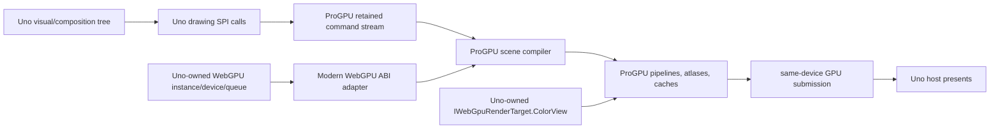

# ProGPU–Uno drawing backend architecture

## 1. Scope

Uno PR #24153 separates the framework render cycle from concrete drawing
engines. It introduces a public SPI for graphics-provider negotiation,
device-bound drawing factories, typed render targets, retained recordings,
geometry, fonts, image codecs, and SVG. This backend consumes those public
contracts exactly as an external backend would. It does not edit or reach into
the PR's Skia or WebGPU renderer code.

The first supported presentation lane is the PR's `IWebGpuDeviceContext` plus
`IWebGpuRenderTarget`. This is the strongest integration point because ProGPU
is itself a WebGPU renderer and can submit directly to the same host-owned
device and texture view.



## 2. What the Uno abstraction enables

The PR provides five properties that make a complete third-party backend
possible without framework modifications:

1. `IGraphicsProvider<TContext>` negotiates a typed device context before a
   backend creates its `IDrawingFactory`.
2. `IDrawingFactory<TTarget>.BeginPresent` receives a typed target, preventing
   a backend from winning a context it cannot present.
3. `ICommandRecorder` and `IRenderRecord` let the backend retain and replay its
   own representation instead of forcing a shared command-list format.
4. `IGeometry.StreamSegments` is a lossless curve-preserving interchange path
   when geometry does not originate in the active backend.
5. Font, geometry, image codec, and SVG services are independently
   registerable, allowing a complete non-Skia content stack.

The abstraction is deliberately lower-level than a retained UI compositor.
Uno keeps visual invalidation and frame orchestration; the backend receives
canvas operations and chooses how much compilation and GPU state to retain.

## 3. WebGPU ABI boundary

### 3.1 Constraint

The Uno branch provisions a modern wgpu-native ABI and exposes its generated
native handles through `Uno.UI.Composition.WebGpu.Init`. The current ProGPU
managed engine describes WebGPU operations with Silk.NET.WebGPU 2.23 types.
Those structures cannot be reinterpreted across the boundary: modern callback
records, chained descriptors, surface structures, and selected enums are not
layout-compatible with the older native ABI.

### 3.2 Decision

`UnoModernWebGpuApi` implements ProGPU's `IWebGpuApi`. Each method translates
the Silk descriptor into the matching modern Uno native descriptor and calls
the public `Uno.WebGpu.Native.WGPU` entry point. Opaque object handles are
pointer-cast only; descriptor structures and enums are translated explicitly.

The adapter is intentionally boring and exhaustive. It has no renderer policy,
resource cache, or presentation ownership. Contract tests cover every
translated descriptor family and callback lifetime.

`UnoBorrowedWebGpuLifetime` implements
`IWebGpuExternalDeviceLifetime`. `Poll(false)` services callbacks without
blocking and `Poll(true)` waits for submitted work when a snapshot or benchmark
boundary requires completion. `Dispose` never releases the instance, adapter,
device, or queue because Uno owns them.

The factory initializes one `WgpuContext` with
`InitializeExternalNativeDevice`, passing the Uno device and queue plus limits
queried from the device. ProGPU creates all of its resources in that device
domain.

The factory also sets the finite deferred-submission safety window to 64 via
`ProGpuBackendOptions.MaximumDeferredQueueSubmissions`. ProGPU keeps its
conservative default of eight for other hosts. The wider window is safe here
because the borrowed device is polled non-blockingly after every submitted
frame; it prevents short bursts from becoming an artificial CPU/GPU fence
while still forcing a blocking drain if retirement falls 64 submissions
behind.

### 3.3 Presentation ownership

For each frame:

1. Uno acquires its target and calls `BeginPresent`.
2. The returned session records overlay/replay operations into a ProGPU
   `DrawingContext`.
3. Disposal seals the recording and normally invokes
   `Compositor.RenderScene(..., target.ColorView)`.
4. ProGPU records and submits GPU work, but does not release or present the
   borrowed view.
5. Control returns to Uno, which completes host presentation.

The target view is valid only during the frame. It is never stored in a
recording, texture wrapper, cache, or asynchronous callback.

HostBackdrop is the one conditional presentation variant. A borrowed swapchain
view is render-attachment-only and cannot be sampled safely. When the command
tree contains a live HostBackdrop material, the factory renders into a
persistent same-size ProGPU texture with `TextureBinding` usage, ProGPU splits
the ordered pass at the backdrop command and captures all preceding content by
GPU ping-pong, and a final fullscreen GPU blit writes the result to the borrowed
view. No CPU readback occurs. The command recorder propagates a retained
HostBackdrop bit through record replay, so frames without HostBackdrop keep the
direct path without rescanning the retained command tree.

## 4. Drawing and retention

### 4.1 Recording

`ProGpuCommandRecorder` owns a `ProGPU.Scene.DrawingContext` and a balanced
state stack. `Finish` transfers a `ProGpuRenderRecord` backed by a
`GpuPicture`. The picture retains the resources referenced by its commands;
`Replay` appends it to the destination session without rebuilding stable
geometry, texture, or glyph identities.

The backend maps Uno operations as follows:

| Uno SPI operation | ProGPU representation |
|---|---|
| solid rectangle | analytic rectangle command + solid brush |
| rounded rectangle/border | analytic rounded rectangle or exact analytic difference ring |
| path fill/stroke | `ProGPU.Vector.PathGeometry` + retained geometry cache |
| linear/radial shader | ProGPU gradient brush with tile/local transform |
| image | same-device `GpuTexture` + source/destination mapping |
| save/restore | balanced retained transform/clip/blend scopes |
| unfiltered layer | retained source-only effect surface + one source-over composite |
| destination-sensitive layer | retained source surface expanded to the preceding destination bounds |
| blend layer | retained source-only effect surface + one final ProGPU blend operation |
| shadow | ProGPU GPU shadow/effect pipeline |
| backdrop effect | compiled ProGPU backdrop/image-effect parameters |

State is recorded, not applied eagerly to a raster surface. `NativeSurface`
returns the active ProGPU `DrawingContext`, enabling a deliberate native
escape hatch without exposing Skia or a host texture view.

Exact uniform-inset rounded border geometries are recognized at the backend
boundary and represented as analytic outer-minus-inner coverage. When nested
inside the matching rounded outer clip, the redundant outer mask is elided.
Non-uniform or arbitrary boolean geometry fails closed to ProGPU's texture-mask
path. This reduced the representative SamplesApp frame from 47 mask draws to
15 and from 46 mask render passes to 14 without changing the Uno drawing SPI.

When a changing Uno root recording replays immutable nested pictures, ProGPU
can retain their compiled vertex/index/draw-call pages. Admission begins only
after reuse, is bounded by count, variants, and age, and requires a minimum
command count. The minimum prevents dictionary/page overhead from regressing
tiny analytic pictures. Exact transform, opacity, clip, blend, target, DPI,
atlas generations, and specialization state form the cache key; unsupported
or masked scopes compile normally.

### 4.2 Text fast path

Uno's current `IFont.BuildGlyphRun` contract produces neutral outline, color
layer, or raster glyph elements which are then drawn through normal path/image
verbs. The ProGPU provider implements this contract using `TtfFont`; therefore
it is fully correct with any drawing backend.

For the ProGPU drawing backend, an internal typed fast path retains the
`TtfFont`, positioned glyph IDs, advances, and offsets and emits ProGPU glyph
commands directly. This preserves ProGPU's glyph atlas, vector outline cache,
color-font support, and first-use validation instead of turning every glyph run
into transient path geometry. The neutral output remains the fallback for a
foreign drawing session.

### 4.3 Effects

The initial effect compiler recognizes source blur and the backdrop material
shapes needed by Uno's backdrop recipe. Image color matrices and `SrcIn` tint
use ProGPU's image-effect pipeline. Unfiltered, blur, drop-shadow, color-matrix,
and blend `SaveLayer` calls record a nested `GpuPicture` and composite it
through a retained effect visual, so the operation sees the complete layer
exactly once as an isolated source. Parameterless `SaveLayer()` uses a
source-over blend visual; this contains clipped transparent clears instead of
applying them directly to the destination. Color-matrix and blend visuals
retain only their source surface. A blend layer commits preceding destination
content before switching blend state, renders the subtree without contaminating
its internal primitive composition, then applies the requested mode once while
restoring the prior state. No effect rewrites individual brushes or reads
pixels back to the CPU.
Porter-Duff modes whose transparent source clears destination (`Src`,
`Modulate`, `DstIn`, `SrcIn`, `SrcOut`, and `DstAtop`) expand the effect surface
to the preceding destination bounds. A replacement clear inside an explicitly
clipped effect layer contributes that clip to the retained bounds. Together
these rules preserve Uno composition masks outside a non-empty mask and when
the mask picture is empty, without allocating a CPU bitmap or an arbitrary
geometry mask.
The conformance corpus exercises every one of Uno's 27 `BlendMode` values with
opaque destination colour, overlapping translucent sources, rounded-edge
coverage, and isolated restoration. ProGPU keeps the corpus in 28 final draws
with no mask passes or per-mode CPU readback.
Other neutral DAGs return `null` from `CreateEffectFilter`, activating Uno's
documented recipe path. Calling an unsupported drawing operation records a
named diagnostic and, by default, throws. No Skia fallback occurs. Arbitrary
effect-DAG and alpha-zero/low-alpha blend edge conformance remain open.

Uno's acrylic graph is lowered to one ProGPU material with blur, luminosity,
tint, noise, and material opacity. ProGPU implements the Color and Luminosity
operators as non-separable blend modes and captures previously rendered host
content in submission order. The GPU ownership/order invariant is covered by
focused pixel tests. The current live SamplesApp acrylic popup still requires
visual and shader-cost tuning against Skia, so it is not claimed as pixel
conformant yet.

## 5. Geometry stack

`ProGpuGeometry` owns a `ProGPU.Vector.PathGeometry` and also implements Uno's
host `Windows.Graphics.IGeometrySource2D` marker so paths can re-enter
`CompositionPath`. The path and
primitive builders create ProGPU figures directly and preserve lines,
quadratics, cubics, arcs, close state, fill rule, and per-figure fill/stroke
metadata.

- Bounds and hit testing use ProGPU vector algorithms.
- Transforms produce immutable transformed paths.
- Boolean combine is represented lazily and evaluated by ProGPU.
- Solid, finite, untrimmed strokes retain their original
  `ProGPU.Vector.PathGeometry` until draw recording. `ProGpuStrokeGeometry`
  maps Uno thickness, joins, miter limit, distinct start/end/dash caps, dash
  intervals, and dash offset to a native ProGPU `Pen`. This lets ProGPU's
  analytic line, quadratic, cubic, and arc stroke compiler operate on the
  original centerline instead of receiving a polygonal outline.
- The deferred stroke remains a complete `IGeometry`: bounds, hit testing,
  transforms, combines, clipping, streaming, and nested stroke requests lazily
  materialize the established widened fill geometry. Trimmed, combined, or
  non-finite styles use that fallback immediately. The split preserves Uno's
  fill-region contract without paying its flattening cost on the direct solid
  draw path.
- Ellipse strokes keep their exact even-odd analytic ring specialization for
  uses such as clipping, where a native pen is not the consuming operation.
- Trim produces a new path from ProGPU path-measure data.
- `StreamSegments` and `StreamFlattened` keep the geometry usable by foreign
  backends and native-host clip consumers.
- Analytic rounded-rectangle metadata is retained where known.

The adapter must not inherit the Avalonia bridge's compatibility-only Skia
stroke-widening shortcut. The Uno backend is a Skia-free qualification lane.

## 6. Text and font stack

`ProGpuFontProvider` uses ProGPU's process-wide `FontManager` for system catalog
enumeration, family/style matching, variable-font instances, and character
fallback. Raw sfnt/TTC bytes create `TtfFont` instances directly. The provider
maps WinUI weight, stretch, style, and optical size to `FontStyleRequest`.

`ProGpuFont` provides:

- OpenType shaping through `OpenTypeTextShaper`, including direction,
  ligatures, clusters, GPOS/GSUB, and script-specific shaping;
- WinUI baseline-relative metrics scaled from font units;
- cmap coverage and glyph advances;
- TrueType and CFF/CFF2 outlines;
- variable-font instances;
- COLR/CPAL vector layers, SVG color glyphs, and sbix/CBDT bitmap glyphs;
- shared font and glyph identities for retained atlas reuse.

Measurement and rendering use the same font object and shaping result. Platform
text APIs are not used in the complete ProGPU lane.

## 7. Images and SVG

The codec seam remains CPU-side by Uno design. `ProGpuImageEncoderDecoder`
uses Uno's Skia-free managed codec to produce the neutral premultiplied BGRA
`IImage`; ProGPU's own embedded color-glyph decoder remains in the font path.
Upload happens once in
`ProGpuDrawingFactory.CreateTexture`; the resulting `GpuTexture` stays resident
until disposed.

`ProGpuSvgRenderer` uses Uno's backend-neutral managed SVG parser with the
registered ProGPU geometry and drawing factories. The resulting document
therefore retains ProGPU paths, gradients, textures, transforms, and clips and
replays entirely through the ProGPU drawing session. SVG text uses the
registered ProGPU font provider, not a platform text renderer.

## 8. Lifetime and threading

| Resource | Owner | Required lifetime |
|---|---|---|
| instance/adapter/device/queue | Uno WebGPU host | outlives factory and all ProGPU GPU resources |
| target texture view | Uno frame | only from `BeginPresent` through session disposal |
| ABI adapter | ProGPU factory | same as borrowed `WgpuContext` |
| ProGPU `WgpuContext` | ProGPU factory | one device generation |
| compositor/pipelines/atlases | ProGPU factory | one device generation; lazy and retained |
| drawing record | Uno render cache | independent of frames; releases retained leases on dispose |
| uploaded texture | caller via `ITexture` | same-device, explicit dispose |
| offscreen texture | factory/caller | explicit dispose; GPU-only until `SnapshotAsync` |

Recording may occur on Uno's UI/render scheduling threads. All command
submission, resource destruction, and device polling are serialized by
`WgpuContext.RenderLock`. Async readback never blocks the UI thread waiting for
a callback that requires the same event loop to progress.

## 9. Device loss

Device loss is specified as a broken ownership generation rather than a local
draw failure:

1. stop accepting new frames for the failed factory;
2. invalidate every retained GPU resource and pending snapshot;
3. dispose the ProGPU context without releasing borrowed host handles;
4. let Uno recreate/negotiate a host WebGPU context;
5. create a new factory/device generation;
6. lazily re-upload CPU-backed content and recompile retained records.

No GPU object may cross generations. The current backend increments and
reports device generations, but injected-loss recovery is not yet runtime
qualified; this remains a hardening gate rather than a completed claim.

## 10. Comparison with other backend models

| Concern | Uno PR #24153 | Avalonia render backend | C++ UI renderer | WPF-compatible renderer |
|---|---|---|---|---|
| framework/backend boundary | public typed drawing SPI | platform render interface plus compositor services | immutable retained scene compiler contract | retained drawing/display-list and render-target services |
| scheduling owner | Uno | Avalonia compositor | framework scene publisher/presenter | dispatcher/media composition system |
| backend input | canvas verbs + opaque retained records | drawing-context verbs and optional retained composition tree | immutable semantic scene revision | drawing primitives/display lists |
| target typing | generic `IDrawingFactory<TTarget>` | render-target/context feature discovery | provider-owned native target | channel/render-target specific |
| device sharing | explicit typed context | platform feature/lease contracts | renderer and presenter share provider device | interop surface/device bridge |
| content seams | geometry/font/image/SVG are public and independent | geometry, font manager, shaper, bitmap are platform services | scene compiler owns all resources and portable text | geometry/text/image services are framework-level |
| retention | backend-owned `IRenderRecord` | render-data caches/composition scene | immutable scene + stable IDs/generations | retained DUCE/display-list resources |
| strongest Uno-specific benefit | external backend can replace the entire stack without host edits | deep service replacement is powerful but more framework-shaped | excellent stable semantic resource identity | strong retained lifetime model but a larger compatibility surface |

The design combines Uno's clean typed target negotiation with ProGPU's retained
semantic resources. From the Avalonia integration it adopts device-domain
leases, deferred submission, and complete service replacement. From the C++ UI
integration it adopts immutable resource identities, transactional scene
updates, explicit unsupported-operation diagnostics, and correctness-gated
benchmarks. From the WPF-compatible integration it adopts strict dispatcher /
render-resource lifetime separation and device-loss generation boundaries.

## 11. Packaging

The backend is a separate project and assembly. It references the ProGPU
submodule projects and `Uno.UI.Composition.WebGpu.Init`, and imports the same
pinned modern wgpu-native provisioning target used by the Uno WebGPU backend.
The application compile aliases ProGPU's optional compatibility projection
when it is present in a restored graph, preventing it from colliding with the
host's own Windows contract assembly. Merged dependency change #125 allows
`ProGPUUseWinRTContracts=false` to remove that reference at its source.
It does not reference `Uno.UI.Composition.Skia` or SkiaSharp.

Build properties gate application references and symbols:

```text
UnoDrawingBackendProGpu=true  -> UNO_DRAWING_PROGPU
UNO_PROGPU=1                  -> choose ProGPU at runtime in multi-backend samples
```

Single-backend production applications register ProGPU directly and need no
environment variable.
